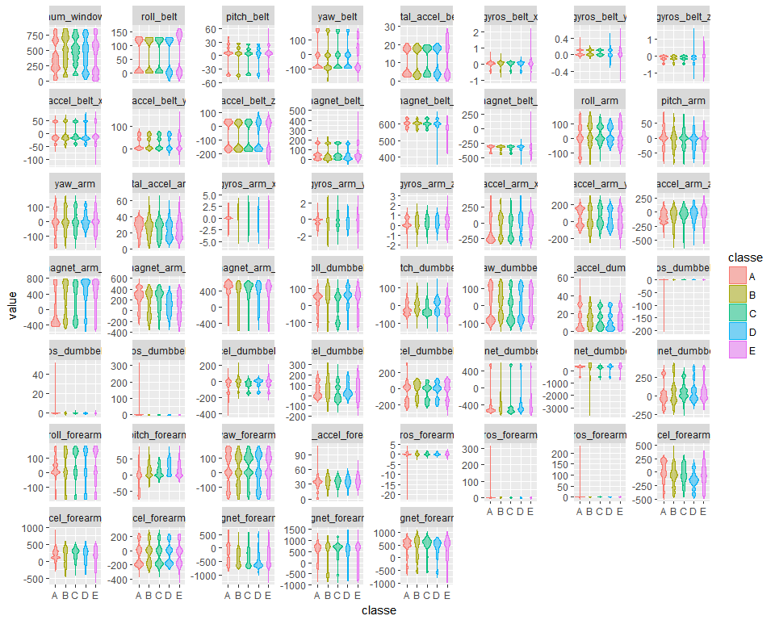
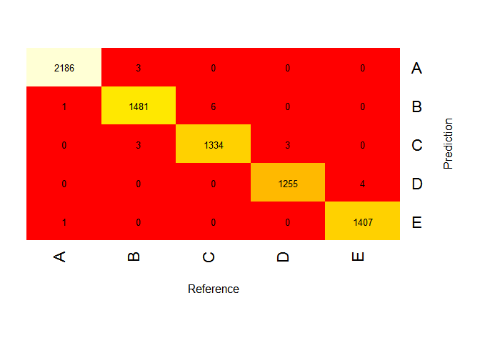

# Qualitative Exercise Prediction
skewdlogix  
July 8, 2017  


### Executive Summary

The study looked at weight lifting exercise data from accelerometers with the goal of predicting the manner in which the exercise was conducted. The available dataset from the *Human Activity Recognition* project provided information on how each exercise was performed and the related five outcomes. Three models - Random Forests, Generalized Boosted Models, and Support Vector Machines - were trained on the dataset using cross-validation and repeated sampling and the outcomes were evaluated on a cross-validation dataset. The Random Forests model achieved the highest Accuracy of 0.9973 and a Kappa value of 0.9965 as well as the lowest OOB estimate of the error rate at 0.26%. This model was then used to predict the outcomes on a test dataset.

### Introduction

Using devices such as *Jawbone Up, Nike FuelBand,* and *Fitbit* it is now possible to collect a large amount of data about personal activity relatively inexpensively. These type of devices are part of the quantified self movement - a group of enthusiasts who take measurements about themselves regularly to improve their health, to find patterns in their behavior, or because they are tech geeks. One thing that people regularly do is quantify how much of a particular activity they do, but they rarely quantify how well they do it. In this project, the goal is to use data from accelerometers on the belt, forearm, arm, and dumbell of 6 participants. They were asked to perform barbell lifts correctly and incorrectly in 5 different ways. 

The various outcomes are: 

*Class A* - performing the exercise exactly according to the specication;
*Class B* - throwing the elbows to the front;
*Class C* - lifting the dumbbell only halfway;
*Class D* - lowering the dumbbell only halfway;
*Class E* - throwing the hips to the front.

### Initial Workspace Preparation

Remove any old files and clean up workspace


```r
rm(list=ls(all=TRUE))
```

Call appropriate libraries for functions


```r
library(caret)
library(e1071)
library(kernlab)
library(doParallel)
library(reshape2)
library(gplots)
library(ggplot2)
```

Get working directory and assign it to wd


```r
wd <- getwd()
```

### Data Acquisition

The data for this assignment come in the form of a comma-separated-value file downloaded from the *Human Activity Recognition* project at http://groupware.les.inf.puc-rio.br/har. The Weight Lifting Exercise (WLE) dataset was compiled during research for the paper, *Velloso, E. et al, "Qualitative Activity Recognition of Weight Lifting Exercises", Proceedings of 4th International Conference in Cooperation with SIGCHI (Augmented Human '13) . Stuttgart, Germany: ACM SIGCHI, 2013*.

First we assign the URL for each file location of the training and testing datasets to the respective variables called TrainFileUrl and TestFileUrl. Then the files are downloaded using the assigned parameters.


```r
TrainFileUrl <- "https://d396qusza40orc.cloudfront.net/predmachlearn/pml-training.csv"

TestFileUrl <- "https://d396qusza40orc.cloudfront.net/predmachlearn/pml-testing.csv"

download.file(TrainFileUrl, file.path(wd, "pml-training.csv"))
download.file(TestFileUrl, file.path(wd, "pml-testing.csv"))
```

Once the files are downloaded to the working directory, they are read into RDS files to prepare them for data analysis. The resulting files are examined to better understand their structure.


```r
traindata <- read.csv("pml-training.csv")
testdata <- read.csv("pml-testing.csv")
str(testdata[,1:20])
```

```
## 'data.frame':	20 obs. of  20 variables:
##  $ X                   : int  1 2 3 4 5 6 7 8 9 10 ...
##  $ user_name           : Factor w/ 6 levels "adelmo","carlitos",..: 6 5 5 1 4 5 5 5 2 3 ...
##  $ raw_timestamp_part_1: int  1323095002 1322673067 1322673075 1322832789 1322489635 1322673149 1322673128 1322673076 1323084240 1322837822 ...
##  $ raw_timestamp_part_2: int  868349 778725 342967 560311 814776 510661 766645 54671 916313 384285 ...
##  $ cvtd_timestamp      : Factor w/ 11 levels "02/12/2011 13:33",..: 5 10 10 1 6 11 11 10 3 2 ...
##  $ new_window          : Factor w/ 1 level "no": 1 1 1 1 1 1 1 1 1 1 ...
##  $ num_window          : int  74 431 439 194 235 504 485 440 323 664 ...
##  $ roll_belt           : num  123 1.02 0.87 125 1.35 -5.92 1.2 0.43 0.93 114 ...
##  $ pitch_belt          : num  27 4.87 1.82 -41.6 3.33 1.59 4.44 4.15 6.72 22.4 ...
##  $ yaw_belt            : num  -4.75 -88.9 -88.5 162 -88.6 -87.7 -87.3 -88.5 -93.7 -13.1 ...
##  $ total_accel_belt    : int  20 4 5 17 3 4 4 4 4 18 ...
##  $ kurtosis_roll_belt  : logi  NA NA NA NA NA NA ...
##  $ kurtosis_picth_belt : logi  NA NA NA NA NA NA ...
##  $ kurtosis_yaw_belt   : logi  NA NA NA NA NA NA ...
##  $ skewness_roll_belt  : logi  NA NA NA NA NA NA ...
##  $ skewness_roll_belt.1: logi  NA NA NA NA NA NA ...
##  $ skewness_yaw_belt   : logi  NA NA NA NA NA NA ...
##  $ max_roll_belt       : logi  NA NA NA NA NA NA ...
##  $ max_picth_belt      : logi  NA NA NA NA NA NA ...
##  $ max_yaw_belt        : logi  NA NA NA NA NA NA ...
```

```r
head(testdata[,1:20],20)
```

```
##     X user_name raw_timestamp_part_1 raw_timestamp_part_2   cvtd_timestamp
## 1   1     pedro           1323095002               868349 05/12/2011 14:23
## 2   2    jeremy           1322673067               778725 30/11/2011 17:11
## 3   3    jeremy           1322673075               342967 30/11/2011 17:11
## 4   4    adelmo           1322832789               560311 02/12/2011 13:33
## 5   5    eurico           1322489635               814776 28/11/2011 14:13
## 6   6    jeremy           1322673149               510661 30/11/2011 17:12
## 7   7    jeremy           1322673128               766645 30/11/2011 17:12
## 8   8    jeremy           1322673076                54671 30/11/2011 17:11
## 9   9  carlitos           1323084240               916313 05/12/2011 11:24
## 10 10   charles           1322837822               384285 02/12/2011 14:57
## 11 11  carlitos           1323084277                36553 05/12/2011 11:24
## 12 12    jeremy           1322673101               442731 30/11/2011 17:11
## 13 13    eurico           1322489661               298656 28/11/2011 14:14
## 14 14    jeremy           1322673043               178652 30/11/2011 17:10
## 15 15    jeremy           1322673156               550750 30/11/2011 17:12
## 16 16    eurico           1322489713               706637 28/11/2011 14:15
## 17 17     pedro           1323094971               920315 05/12/2011 14:22
## 18 18  carlitos           1323084285               176314 05/12/2011 11:24
## 19 19     pedro           1323094999               828379 05/12/2011 14:23
## 20 20    eurico           1322489658               106658 28/11/2011 14:14
##    new_window num_window roll_belt pitch_belt yaw_belt total_accel_belt
## 1          no         74    123.00      27.00    -4.75               20
## 2          no        431      1.02       4.87   -88.90                4
## 3          no        439      0.87       1.82   -88.50                5
## 4          no        194    125.00     -41.60   162.00               17
## 5          no        235      1.35       3.33   -88.60                3
## 6          no        504     -5.92       1.59   -87.70                4
## 7          no        485      1.20       4.44   -87.30                4
## 8          no        440      0.43       4.15   -88.50                4
## 9          no        323      0.93       6.72   -93.70                4
## 10         no        664    114.00      22.40   -13.10               18
## 11         no        859      0.92       5.94   -92.70                3
## 12         no        461      1.01       4.96   -87.80                5
## 13         no        257      0.54       2.45   -88.60                3
## 14         no        408      0.45       5.02   -87.90                5
## 15         no        779      5.34      -3.09   -80.30                4
## 16         no        302      1.65       3.47   -87.00                2
## 17         no         48    129.00      27.80     1.84               21
## 18         no        361      0.92       5.31   -93.10                3
## 19         no         72    123.00      26.70    -2.68               19
## 20         no        255      1.40       3.20   -88.70                3
##    kurtosis_roll_belt kurtosis_picth_belt kurtosis_yaw_belt
## 1                  NA                  NA                NA
## 2                  NA                  NA                NA
## 3                  NA                  NA                NA
## 4                  NA                  NA                NA
## 5                  NA                  NA                NA
## 6                  NA                  NA                NA
## 7                  NA                  NA                NA
## 8                  NA                  NA                NA
## 9                  NA                  NA                NA
## 10                 NA                  NA                NA
## 11                 NA                  NA                NA
## 12                 NA                  NA                NA
## 13                 NA                  NA                NA
## 14                 NA                  NA                NA
## 15                 NA                  NA                NA
## 16                 NA                  NA                NA
## 17                 NA                  NA                NA
## 18                 NA                  NA                NA
## 19                 NA                  NA                NA
## 20                 NA                  NA                NA
##    skewness_roll_belt skewness_roll_belt.1 skewness_yaw_belt max_roll_belt
## 1                  NA                   NA                NA            NA
## 2                  NA                   NA                NA            NA
## 3                  NA                   NA                NA            NA
## 4                  NA                   NA                NA            NA
## 5                  NA                   NA                NA            NA
## 6                  NA                   NA                NA            NA
## 7                  NA                   NA                NA            NA
## 8                  NA                   NA                NA            NA
## 9                  NA                   NA                NA            NA
## 10                 NA                   NA                NA            NA
## 11                 NA                   NA                NA            NA
## 12                 NA                   NA                NA            NA
## 13                 NA                   NA                NA            NA
## 14                 NA                   NA                NA            NA
## 15                 NA                   NA                NA            NA
## 16                 NA                   NA                NA            NA
## 17                 NA                   NA                NA            NA
## 18                 NA                   NA                NA            NA
## 19                 NA                   NA                NA            NA
## 20                 NA                   NA                NA            NA
##    max_picth_belt max_yaw_belt
## 1              NA           NA
## 2              NA           NA
## 3              NA           NA
## 4              NA           NA
## 5              NA           NA
## 6              NA           NA
## 7              NA           NA
## 8              NA           NA
## 9              NA           NA
## 10             NA           NA
## 11             NA           NA
## 12             NA           NA
## 13             NA           NA
## 14             NA           NA
## 15             NA           NA
## 16             NA           NA
## 17             NA           NA
## 18             NA           NA
## 19             NA           NA
## 20             NA           NA
```

### Variable Selection

We immediately see that many variables in the testdata dataset are comprised completely of NA's. This indicates that any of these same variables in the traindata dataset will have no predictive power in determing outcomes in the testdata dataset. Given this situation, our first step in variable selection is to eliminate any variables in the traindata and testdata datsets that have all NA's in the testdata dataset.   


```r
isna <- sapply(testdata, function(x)all(is.na(x)))
index <- which(isna == 0)
test <- testdata[,index]
train <- traindata[,index]
dim(test)
```

```
## [1] 20 60
```

```r
dim(train)
```

```
## [1] 19622    60
```

Eliminating variables with all NA's for observations in the test dataset has reduced the number of included variables to 60 from 160. The next stage of variable selection is to examine the 60 variables included in the train dataset to see their composition.


```r
str(test[,1:60])
```

```
## 'data.frame':	20 obs. of  60 variables:
##  $ X                   : int  1 2 3 4 5 6 7 8 9 10 ...
##  $ user_name           : Factor w/ 6 levels "adelmo","carlitos",..: 6 5 5 1 4 5 5 5 2 3 ...
##  $ raw_timestamp_part_1: int  1323095002 1322673067 1322673075 1322832789 1322489635 1322673149 1322673128 1322673076 1323084240 1322837822 ...
##  $ raw_timestamp_part_2: int  868349 778725 342967 560311 814776 510661 766645 54671 916313 384285 ...
##  $ cvtd_timestamp      : Factor w/ 11 levels "02/12/2011 13:33",..: 5 10 10 1 6 11 11 10 3 2 ...
##  $ new_window          : Factor w/ 1 level "no": 1 1 1 1 1 1 1 1 1 1 ...
##  $ num_window          : int  74 431 439 194 235 504 485 440 323 664 ...
##  $ roll_belt           : num  123 1.02 0.87 125 1.35 -5.92 1.2 0.43 0.93 114 ...
##  $ pitch_belt          : num  27 4.87 1.82 -41.6 3.33 1.59 4.44 4.15 6.72 22.4 ...
##  $ yaw_belt            : num  -4.75 -88.9 -88.5 162 -88.6 -87.7 -87.3 -88.5 -93.7 -13.1 ...
##  $ total_accel_belt    : int  20 4 5 17 3 4 4 4 4 18 ...
##  $ gyros_belt_x        : num  -0.5 -0.06 0.05 0.11 0.03 0.1 -0.06 -0.18 0.1 0.14 ...
##  $ gyros_belt_y        : num  -0.02 -0.02 0.02 0.11 0.02 0.05 0 -0.02 0 0.11 ...
##  $ gyros_belt_z        : num  -0.46 -0.07 0.03 -0.16 0 -0.13 0 -0.03 -0.02 -0.16 ...
##  $ accel_belt_x        : int  -38 -13 1 46 -8 -11 -14 -10 -15 -25 ...
##  $ accel_belt_y        : int  69 11 -1 45 4 -16 2 -2 1 63 ...
##  $ accel_belt_z        : int  -179 39 49 -156 27 38 35 42 32 -158 ...
##  $ magnet_belt_x       : int  -13 43 29 169 33 31 50 39 -6 10 ...
##  $ magnet_belt_y       : int  581 636 631 608 566 638 622 635 600 601 ...
##  $ magnet_belt_z       : int  -382 -309 -312 -304 -418 -291 -315 -305 -302 -330 ...
##  $ roll_arm            : num  40.7 0 0 -109 76.1 0 0 0 -137 -82.4 ...
##  $ pitch_arm           : num  -27.8 0 0 55 2.76 0 0 0 11.2 -63.8 ...
##  $ yaw_arm             : num  178 0 0 -142 102 0 0 0 -167 -75.3 ...
##  $ total_accel_arm     : int  10 38 44 25 29 14 15 22 34 32 ...
##  $ gyros_arm_x         : num  -1.65 -1.17 2.1 0.22 -1.96 0.02 2.36 -3.71 0.03 0.26 ...
##  $ gyros_arm_y         : num  0.48 0.85 -1.36 -0.51 0.79 0.05 -1.01 1.85 -0.02 -0.5 ...
##  $ gyros_arm_z         : num  -0.18 -0.43 1.13 0.92 -0.54 -0.07 0.89 -0.69 -0.02 0.79 ...
##  $ accel_arm_x         : int  16 -290 -341 -238 -197 -26 99 -98 -287 -301 ...
##  $ accel_arm_y         : int  38 215 245 -57 200 130 79 175 111 -42 ...
##  $ accel_arm_z         : int  93 -90 -87 6 -30 -19 -67 -78 -122 -80 ...
##  $ magnet_arm_x        : int  -326 -325 -264 -173 -170 396 702 535 -367 -420 ...
##  $ magnet_arm_y        : int  385 447 474 257 275 176 15 215 335 294 ...
##  $ magnet_arm_z        : int  481 434 413 633 617 516 217 385 520 493 ...
##  $ roll_dumbbell       : num  -17.7 54.5 57.1 43.1 -101.4 ...
##  $ pitch_dumbbell      : num  25 -53.7 -51.4 -30 -53.4 ...
##  $ yaw_dumbbell        : num  126.2 -75.5 -75.2 -103.3 -14.2 ...
##  $ total_accel_dumbbell: int  9 31 29 18 4 29 29 29 3 2 ...
##  $ gyros_dumbbell_x    : num  0.64 0.34 0.39 0.1 0.29 -0.59 0.34 0.37 0.03 0.42 ...
##  $ gyros_dumbbell_y    : num  0.06 0.05 0.14 -0.02 -0.47 0.8 0.16 0.14 -0.21 0.51 ...
##  $ gyros_dumbbell_z    : num  -0.61 -0.71 -0.34 0.05 -0.46 1.1 -0.23 -0.39 -0.21 -0.03 ...
##  $ accel_dumbbell_x    : int  21 -153 -141 -51 -18 -138 -145 -140 0 -7 ...
##  $ accel_dumbbell_y    : int  -15 155 155 72 -30 166 150 159 25 -20 ...
##  $ accel_dumbbell_z    : int  81 -205 -196 -148 -5 -186 -190 -191 9 7 ...
##  $ magnet_dumbbell_x   : int  523 -502 -506 -576 -424 -543 -484 -515 -519 -531 ...
##  $ magnet_dumbbell_y   : int  -528 388 349 238 252 262 354 350 348 321 ...
##  $ magnet_dumbbell_z   : int  -56 -36 41 53 312 96 97 53 -32 -164 ...
##  $ roll_forearm        : num  141 109 131 0 -176 150 155 -161 15.5 13.2 ...
##  $ pitch_forearm       : num  49.3 -17.6 -32.6 0 -2.16 1.46 34.5 43.6 -63.5 19.4 ...
##  $ yaw_forearm         : num  156 106 93 0 -47.9 89.7 152 -89.5 -139 -105 ...
##  $ total_accel_forearm : int  33 39 34 43 24 43 32 47 36 24 ...
##  $ gyros_forearm_x     : num  0.74 1.12 0.18 1.38 -0.75 -0.88 -0.53 0.63 0.03 0.02 ...
##  $ gyros_forearm_y     : num  -3.34 -2.78 -0.79 0.69 3.1 4.26 1.8 -0.74 0.02 0.13 ...
##  $ gyros_forearm_z     : num  -0.59 -0.18 0.28 1.8 0.8 1.35 0.75 0.49 -0.02 -0.07 ...
##  $ accel_forearm_x     : int  -110 212 154 -92 131 230 -192 -151 195 -212 ...
##  $ accel_forearm_y     : int  267 297 271 406 -93 322 170 -331 204 98 ...
##  $ accel_forearm_z     : int  -149 -118 -129 -39 172 -144 -175 -282 -217 -7 ...
##  $ magnet_forearm_x    : int  -714 -237 -51 -233 375 -300 -678 -109 0 -403 ...
##  $ magnet_forearm_y    : int  419 791 698 783 -787 800 284 -619 652 723 ...
##  $ magnet_forearm_z    : int  617 873 783 521 91 884 585 -32 469 512 ...
##  $ problem_id          : int  1 2 3 4 5 6 7 8 9 10 ...
```

```r
str(train[,1:60])
```

```
## 'data.frame':	19622 obs. of  60 variables:
##  $ X                   : int  1 2 3 4 5 6 7 8 9 10 ...
##  $ user_name           : Factor w/ 6 levels "adelmo","carlitos",..: 2 2 2 2 2 2 2 2 2 2 ...
##  $ raw_timestamp_part_1: int  1323084231 1323084231 1323084231 1323084232 1323084232 1323084232 1323084232 1323084232 1323084232 1323084232 ...
##  $ raw_timestamp_part_2: int  788290 808298 820366 120339 196328 304277 368296 440390 484323 484434 ...
##  $ cvtd_timestamp      : Factor w/ 20 levels "02/12/2011 13:32",..: 9 9 9 9 9 9 9 9 9 9 ...
##  $ new_window          : Factor w/ 2 levels "no","yes": 1 1 1 1 1 1 1 1 1 1 ...
##  $ num_window          : int  11 11 11 12 12 12 12 12 12 12 ...
##  $ roll_belt           : num  1.41 1.41 1.42 1.48 1.48 1.45 1.42 1.42 1.43 1.45 ...
##  $ pitch_belt          : num  8.07 8.07 8.07 8.05 8.07 8.06 8.09 8.13 8.16 8.17 ...
##  $ yaw_belt            : num  -94.4 -94.4 -94.4 -94.4 -94.4 -94.4 -94.4 -94.4 -94.4 -94.4 ...
##  $ total_accel_belt    : int  3 3 3 3 3 3 3 3 3 3 ...
##  $ gyros_belt_x        : num  0 0.02 0 0.02 0.02 0.02 0.02 0.02 0.02 0.03 ...
##  $ gyros_belt_y        : num  0 0 0 0 0.02 0 0 0 0 0 ...
##  $ gyros_belt_z        : num  -0.02 -0.02 -0.02 -0.03 -0.02 -0.02 -0.02 -0.02 -0.02 0 ...
##  $ accel_belt_x        : int  -21 -22 -20 -22 -21 -21 -22 -22 -20 -21 ...
##  $ accel_belt_y        : int  4 4 5 3 2 4 3 4 2 4 ...
##  $ accel_belt_z        : int  22 22 23 21 24 21 21 21 24 22 ...
##  $ magnet_belt_x       : int  -3 -7 -2 -6 -6 0 -4 -2 1 -3 ...
##  $ magnet_belt_y       : int  599 608 600 604 600 603 599 603 602 609 ...
##  $ magnet_belt_z       : int  -313 -311 -305 -310 -302 -312 -311 -313 -312 -308 ...
##  $ roll_arm            : num  -128 -128 -128 -128 -128 -128 -128 -128 -128 -128 ...
##  $ pitch_arm           : num  22.5 22.5 22.5 22.1 22.1 22 21.9 21.8 21.7 21.6 ...
##  $ yaw_arm             : num  -161 -161 -161 -161 -161 -161 -161 -161 -161 -161 ...
##  $ total_accel_arm     : int  34 34 34 34 34 34 34 34 34 34 ...
##  $ gyros_arm_x         : num  0 0.02 0.02 0.02 0 0.02 0 0.02 0.02 0.02 ...
##  $ gyros_arm_y         : num  0 -0.02 -0.02 -0.03 -0.03 -0.03 -0.03 -0.02 -0.03 -0.03 ...
##  $ gyros_arm_z         : num  -0.02 -0.02 -0.02 0.02 0 0 0 0 -0.02 -0.02 ...
##  $ accel_arm_x         : int  -288 -290 -289 -289 -289 -289 -289 -289 -288 -288 ...
##  $ accel_arm_y         : int  109 110 110 111 111 111 111 111 109 110 ...
##  $ accel_arm_z         : int  -123 -125 -126 -123 -123 -122 -125 -124 -122 -124 ...
##  $ magnet_arm_x        : int  -368 -369 -368 -372 -374 -369 -373 -372 -369 -376 ...
##  $ magnet_arm_y        : int  337 337 344 344 337 342 336 338 341 334 ...
##  $ magnet_arm_z        : int  516 513 513 512 506 513 509 510 518 516 ...
##  $ roll_dumbbell       : num  13.1 13.1 12.9 13.4 13.4 ...
##  $ pitch_dumbbell      : num  -70.5 -70.6 -70.3 -70.4 -70.4 ...
##  $ yaw_dumbbell        : num  -84.9 -84.7 -85.1 -84.9 -84.9 ...
##  $ total_accel_dumbbell: int  37 37 37 37 37 37 37 37 37 37 ...
##  $ gyros_dumbbell_x    : num  0 0 0 0 0 0 0 0 0 0 ...
##  $ gyros_dumbbell_y    : num  -0.02 -0.02 -0.02 -0.02 -0.02 -0.02 -0.02 -0.02 -0.02 -0.02 ...
##  $ gyros_dumbbell_z    : num  0 0 0 -0.02 0 0 0 0 0 0 ...
##  $ accel_dumbbell_x    : int  -234 -233 -232 -232 -233 -234 -232 -234 -232 -235 ...
##  $ accel_dumbbell_y    : int  47 47 46 48 48 48 47 46 47 48 ...
##  $ accel_dumbbell_z    : int  -271 -269 -270 -269 -270 -269 -270 -272 -269 -270 ...
##  $ magnet_dumbbell_x   : int  -559 -555 -561 -552 -554 -558 -551 -555 -549 -558 ...
##  $ magnet_dumbbell_y   : int  293 296 298 303 292 294 295 300 292 291 ...
##  $ magnet_dumbbell_z   : num  -65 -64 -63 -60 -68 -66 -70 -74 -65 -69 ...
##  $ roll_forearm        : num  28.4 28.3 28.3 28.1 28 27.9 27.9 27.8 27.7 27.7 ...
##  $ pitch_forearm       : num  -63.9 -63.9 -63.9 -63.9 -63.9 -63.9 -63.9 -63.8 -63.8 -63.8 ...
##  $ yaw_forearm         : num  -153 -153 -152 -152 -152 -152 -152 -152 -152 -152 ...
##  $ total_accel_forearm : int  36 36 36 36 36 36 36 36 36 36 ...
##  $ gyros_forearm_x     : num  0.03 0.02 0.03 0.02 0.02 0.02 0.02 0.02 0.03 0.02 ...
##  $ gyros_forearm_y     : num  0 0 -0.02 -0.02 0 -0.02 0 -0.02 0 0 ...
##  $ gyros_forearm_z     : num  -0.02 -0.02 0 0 -0.02 -0.03 -0.02 0 -0.02 -0.02 ...
##  $ accel_forearm_x     : int  192 192 196 189 189 193 195 193 193 190 ...
##  $ accel_forearm_y     : int  203 203 204 206 206 203 205 205 204 205 ...
##  $ accel_forearm_z     : int  -215 -216 -213 -214 -214 -215 -215 -213 -214 -215 ...
##  $ magnet_forearm_x    : int  -17 -18 -18 -16 -17 -9 -18 -9 -16 -22 ...
##  $ magnet_forearm_y    : num  654 661 658 658 655 660 659 660 653 656 ...
##  $ magnet_forearm_z    : num  476 473 469 469 473 478 470 474 476 473 ...
##  $ classe              : Factor w/ 5 levels "A","B","C","D",..: 1 1 1 1 1 1 1 1 1 1 ...
```

In the test datset we see that the variable "X" is merely a row indicator and that "new_window" is a factor variable with only one level 'no'. Both variables have no predictive power and should be removed from both the train and test datasets. Before removing the variable "new_window" from the train dataset, we first remove all rows where "new_window" is not equal to 'no' since these observations are not relevant. In addition, we need to remove timestamp variables and "user_name" since these observations are not relevant to the prediction modeling either.


```r
test <- test[,!names(test) %in% c("X","new_window", "user_name", "raw_timestamp_part_1", "raw_timestamp_part_2", "cvtd_timestamp")]
train <- train[train$new_window == 'no',]
train <- train[,!names(train) %in% c("X","new_window", "user_name", "raw_timestamp_part_1", "raw_timestamp_part_2", "cvtd_timestamp")]
```

As a final check, we examine the chosen variables to ensure that they are not highly correlated with each other. All factor variables and time stamp data need to be removed before calculating correlation coefficients.


```r
descrCor <-  cor(train[,!names(train) %in% c("classe")])
highCorr <- sum(abs(descrCor[upper.tri(descrCor)]) > .999)
highCorr
```

```
## [1] 0
```

We also want to ensure that no variables have near zero variance.


```r
nzv <- nearZeroVar(train)
dim(nzv)
```

```
## NULL
```

Next we plot the chosen variables.


```r
train_narrow <- melt(train, id.vars= "classe", variable.name= "Measurement")
ggplot(train_narrow, aes(x=classe, y=value)) +
geom_violin(aes(color=classe, fill=classe), alpha=1/2) +
facet_wrap(~ Measurement, scale="free_y")
```

<!-- -->

It is obvious frm the varying magnitudes of these included variables that they will need to be standardized (centered and scaled) in order to properly model them. First we need to split them into train and cross-validaton datasets.

### Split Train Dataset into Train and Cross-Validation Sub-datasets

Now that we have the variables chosen, the next step is to break out the train dataset into training and cross-validaton sub-datasets. By using "createDataPartition" from the Caret package we can stratify the two datasets such that they each contain an equal number of levels of the target factor variable "classe".


```r
set.seed(123)
inTrain <- createDataPartition(train$classe, p=.60, list=FALSE)
classeTrain <- train[inTrain,]
classeCv <- train[-inTrain,]
dim(classeTrain)
```

```
## [1] 11532    54
```

```r
dim(classeCv)
```

```
## [1] 7684   54
```

### Model Preprocessing

We now set the model preprocessing requirements that will be used in the model development. First we need to center and scale the data to eliminate any influence from variables with larger magnitudes.The classeTrain dataset is centered and scaled and then the classeCv dataset is centered and scaled with the same transformations.


```r
preProc <- preProcess(classeTrain[,!names(classeTrain) %in% c("classe")], method= c("center", "scale"))
classeTrainMod <- predict(preProc, classeTrain)
classeCvMod <- predict(preProc, classeCv)
```

Next we set up the control parameter for the model estimation. We use the trainControl function to specify the type of resampling. In this case we are using  three separate 10-fold cross-validations as the resampling scheme. Additionally, we are enabling parallel processing, the calculation of class probabilities and saving any predictions.


```r
cntrl <- trainControl(method="repeatedcv", number=10, repeats=3, allowParallel = TRUE, classProbs=TRUE, savePredictions=TRUE)
```

### Parallel Processing

Paarallel processing is used in order to speed up processing since we are evaluating 3 models with 10-fold cross-validation repeated 3 times.


```r
cl <- makeCluster(detectCores() - 1)
registerDoParallel(cl)
```

### Model Tuning and Execution


```r
set.seed(123)
model_rf <- train(classe~., data= classeTrainMod, method= "rf", trControl= cntrl)
set.seed(123)
model_gbm <- train(classe~., data= classeTrainMod, method= "gbm", trControl= cntrl, verbose= FALSE)
set.seed(123)
model_svm <- train(classe~., data= classeTrainMod, method= "svmRadial", trControl= cntrl)
```

After model execution we need to stop the clusters from parallel processing.


```r
stopCluster(cl)
```

### Model Evaluation and Comparison

First evaluate on train sub-dataset. we will use Accuracy and Out-of-sample error to evaluate the respective models.


```r
pred_rf <- predict(model_rf, classeTrainMod)
cm_tr1 <- confusionMatrix(pred_rf, classeTrain[, "classe"])
Accuracy <- cm_tr1$overall[[1]]
OutOfSampleError <- 1-cm_tr1$overall[[1]]
tr1 <- rbind(Accuracy, OutOfSampleError)
colnames(tr1) <- "Result"
cm_tr1
```

```
## Confusion Matrix and Statistics
## 
##           Reference
## Prediction    A    B    C    D    E
##          A 3283    0    0    0    0
##          B    0 2231    0    0    0
##          C    0    0 2012    0    0
##          D    0    0    0 1889    0
##          E    0    0    0    0 2117
## 
## Overall Statistics
##                                      
##                Accuracy : 1          
##                  95% CI : (0.9997, 1)
##     No Information Rate : 0.2847     
##     P-Value [Acc > NIR] : < 2.2e-16  
##                                      
##                   Kappa : 1          
##  Mcnemar's Test P-Value : NA         
## 
## Statistics by Class:
## 
##                      Class: A Class: B Class: C Class: D Class: E
## Sensitivity            1.0000   1.0000   1.0000   1.0000   1.0000
## Specificity            1.0000   1.0000   1.0000   1.0000   1.0000
## Pos Pred Value         1.0000   1.0000   1.0000   1.0000   1.0000
## Neg Pred Value         1.0000   1.0000   1.0000   1.0000   1.0000
## Prevalence             0.2847   0.1935   0.1745   0.1638   0.1836
## Detection Rate         0.2847   0.1935   0.1745   0.1638   0.1836
## Detection Prevalence   0.2847   0.1935   0.1745   0.1638   0.1836
## Balanced Accuracy      1.0000   1.0000   1.0000   1.0000   1.0000
```

```r
tr1
```

```
##                  Result
## Accuracy              1
## OutOfSampleError      0
```

```r
pred_gbm <- predict(model_gbm, classeTrainMod)
cm_tr2 <- confusionMatrix(pred_gbm, classeTrain[, "classe"])
Accuracy <- cm_tr2$overall[[1]]
OutOfSampleError <- 1-cm_tr2$overall[[1]]
tr2 <- rbind(Accuracy, OutOfSampleError)
colnames(tr2) <- "Result"
cm_tr2
```

```
## Confusion Matrix and Statistics
## 
##           Reference
## Prediction    A    B    C    D    E
##          A 3280    8    0    0    0
##          B    3 2213    7    2    6
##          C    0    9 2003   15    2
##          D    0    1    0 1870   12
##          E    0    0    2    2 2097
## 
## Overall Statistics
##                                           
##                Accuracy : 0.994           
##                  95% CI : (0.9924, 0.9953)
##     No Information Rate : 0.2847          
##     P-Value [Acc > NIR] : < 2.2e-16       
##                                           
##                   Kappa : 0.9924          
##  Mcnemar's Test P-Value : NA              
## 
## Statistics by Class:
## 
##                      Class: A Class: B Class: C Class: D Class: E
## Sensitivity            0.9991   0.9919   0.9955   0.9899   0.9906
## Specificity            0.9990   0.9981   0.9973   0.9987   0.9996
## Pos Pred Value         0.9976   0.9919   0.9872   0.9931   0.9981
## Neg Pred Value         0.9996   0.9981   0.9991   0.9980   0.9979
## Prevalence             0.2847   0.1935   0.1745   0.1638   0.1836
## Detection Rate         0.2844   0.1919   0.1737   0.1622   0.1818
## Detection Prevalence   0.2851   0.1935   0.1759   0.1633   0.1822
## Balanced Accuracy      0.9991   0.9950   0.9964   0.9943   0.9951
```

```r
tr2
```

```
##                       Result
## Accuracy         0.994016649
## OutOfSampleError 0.005983351
```

```r
pred_svm <- predict(model_svm, classeTrainMod)
cm_tr3 <- confusionMatrix(pred_svm, classeTrain[, "classe"])
Accuracy <- cm_tr3$overall[[1]]
OutOfSampleError <- 1-cm_tr3$overall[[1]]
tr3 <- rbind(Accuracy, OutOfSampleError)
colnames(tr3) <- "Result"
cm_tr3
```

```
## Confusion Matrix and Statistics
## 
##           Reference
## Prediction    A    B    C    D    E
##          A 3222   98   58  173   22
##          B   33 2069  135  238  122
##          C   21   61 1504  289  115
##          D    0    0  311  825   95
##          E    7    3    4  364 1763
## 
## Overall Statistics
##                                           
##                Accuracy : 0.8136          
##                  95% CI : (0.8064, 0.8207)
##     No Information Rate : 0.2847          
##     P-Value [Acc > NIR] : < 2.2e-16       
##                                           
##                   Kappa : 0.7631          
##  Mcnemar's Test P-Value : < 2.2e-16       
## 
## Statistics by Class:
## 
##                      Class: A Class: B Class: C Class: D Class: E
## Sensitivity            0.9814   0.9274   0.7475  0.43674   0.8328
## Specificity            0.9574   0.9432   0.9489  0.95790   0.9599
## Pos Pred Value         0.9018   0.7967   0.7558  0.67019   0.8234
## Neg Pred Value         0.9923   0.9819   0.9468  0.89671   0.9623
## Prevalence             0.2847   0.1935   0.1745  0.16381   0.1836
## Detection Rate         0.2794   0.1794   0.1304  0.07154   0.1529
## Detection Prevalence   0.3098   0.2252   0.1726  0.10675   0.1857
## Balanced Accuracy      0.9694   0.9353   0.8482  0.69732   0.8963
```

```r
tr3
```

```
##                    Result
## Accuracy         0.813649
## OutOfSampleError 0.186351
```

NeXt evaluate on cross-validation sub-dataset.

```r
pred_rf <- predict(model_rf, classeCvMod)
cm_cv1 <- confusionMatrix(pred_rf, classeCv[, "classe"])
Accuracy <- cm_cv1$overall[[1]]
OutOfSampleError <- 1-cm_cv1$overall[[1]]
cv1 <- rbind(Accuracy, OutOfSampleError)
colnames(cv1) <- "Result"
cm_cv1
```

```
## Confusion Matrix and Statistics
## 
##           Reference
## Prediction    A    B    C    D    E
##          A 2186    3    0    0    0
##          B    1 1481    6    0    0
##          C    0    3 1334    3    0
##          D    0    0    0 1255    4
##          E    1    0    0    0 1407
## 
## Overall Statistics
##                                           
##                Accuracy : 0.9973          
##                  95% CI : (0.9958, 0.9983)
##     No Information Rate : 0.2847          
##     P-Value [Acc > NIR] : < 2.2e-16       
##                                           
##                   Kappa : 0.9965          
##  Mcnemar's Test P-Value : NA              
## 
## Statistics by Class:
## 
##                      Class: A Class: B Class: C Class: D Class: E
## Sensitivity            0.9991   0.9960   0.9955   0.9976   0.9972
## Specificity            0.9995   0.9989   0.9991   0.9994   0.9998
## Pos Pred Value         0.9986   0.9953   0.9955   0.9968   0.9993
## Neg Pred Value         0.9996   0.9990   0.9991   0.9995   0.9994
## Prevalence             0.2847   0.1935   0.1744   0.1637   0.1836
## Detection Rate         0.2845   0.1927   0.1736   0.1633   0.1831
## Detection Prevalence   0.2849   0.1936   0.1744   0.1638   0.1832
## Balanced Accuracy      0.9993   0.9974   0.9973   0.9985   0.9985
```

```r
cv1
```

```
##                       Result
## Accuracy         0.997267048
## OutOfSampleError 0.002732952
```

```r
pred_gbm <- predict(model_gbm, classeCvMod)
cm_cv2 <- confusionMatrix(pred_gbm, classeCv[, "classe"])
Accuracy <- cm_cv2$overall[[1]]
OutOfSampleError <- 1-cm_cv2$overall[[1]]
cv2 <- rbind(Accuracy, OutOfSampleError)
colnames(cv2) <- "Result"
cm_cv2
```

```
## Confusion Matrix and Statistics
## 
##           Reference
## Prediction    A    B    C    D    E
##          A 2179    8    0    0    1
##          B    9 1464   11    5    7
##          C    0   14 1327   12    1
##          D    0    1    1 1238   20
##          E    0    0    1    3 1382
## 
## Overall Statistics
##                                           
##                Accuracy : 0.9878          
##                  95% CI : (0.9851, 0.9901)
##     No Information Rate : 0.2847          
##     P-Value [Acc > NIR] : < 2.2e-16       
##                                           
##                   Kappa : 0.9845          
##  Mcnemar's Test P-Value : NA              
## 
## Statistics by Class:
## 
##                      Class: A Class: B Class: C Class: D Class: E
## Sensitivity            0.9959   0.9845   0.9903   0.9841   0.9794
## Specificity            0.9984   0.9948   0.9957   0.9966   0.9994
## Pos Pred Value         0.9959   0.9786   0.9801   0.9825   0.9971
## Neg Pred Value         0.9984   0.9963   0.9979   0.9969   0.9954
## Prevalence             0.2847   0.1935   0.1744   0.1637   0.1836
## Detection Rate         0.2836   0.1905   0.1727   0.1611   0.1799
## Detection Prevalence   0.2847   0.1947   0.1762   0.1640   0.1804
## Balanced Accuracy      0.9971   0.9897   0.9930   0.9903   0.9894
```

```r
cv2
```

```
##                      Result
## Accuracy         0.98776679
## OutOfSampleError 0.01223321
```

```r
pred_svm <- predict(model_svm, classeCvMod)
cm_cv3 <- confusionMatrix(pred_svm, classeCv[, "classe"])
Accuracy <- cm_cv3$overall[[1]]
OutOfSampleError <- 1-cm_cv3$overall[[1]]
cv3 <- rbind(Accuracy, OutOfSampleError)
colnames(cv3) <- "Result"
cm_cv3
```

```
## Confusion Matrix and Statistics
## 
##           Reference
## Prediction    A    B    C    D    E
##          A 2146   81   51  132   19
##          B   30 1341  109  154   71
##          C    6   60  982  199   94
##          D    0    0  193  554   71
##          E    6    5    5  219 1156
## 
## Overall Statistics
##                                          
##                Accuracy : 0.8041         
##                  95% CI : (0.7951, 0.813)
##     No Information Rate : 0.2847         
##     P-Value [Acc > NIR] : < 2.2e-16      
##                                          
##                   Kappa : 0.7508         
##  Mcnemar's Test P-Value : < 2.2e-16      
## 
## Statistics by Class:
## 
##                      Class: A Class: B Class: C Class: D Class: E
## Sensitivity            0.9808   0.9018   0.7328   0.4404   0.8193
## Specificity            0.9485   0.9413   0.9434   0.9589   0.9625
## Pos Pred Value         0.8835   0.7865   0.7323   0.6773   0.8311
## Neg Pred Value         0.9920   0.9756   0.9436   0.8975   0.9595
## Prevalence             0.2847   0.1935   0.1744   0.1637   0.1836
## Detection Rate         0.2793   0.1745   0.1278   0.0721   0.1504
## Detection Prevalence   0.3161   0.2219   0.1745   0.1065   0.1810
## Balanced Accuracy      0.9647   0.9215   0.8381   0.6996   0.8909
```

```r
cv3
```

```
##                     Result
## Accuracy         0.8041385
## OutOfSampleError 0.1958615
```

### Final Model

THe superior model was the Random Forest ("rf") model with a training accuracy of 1, an out-of-sample error of 0, a sensitivity level of 1, and a specificity level of 1.  
The cross-validation dataset accuracy was very close at 0.9973, an out-of-sample error of 0.0027, a sensitivity level between 0.9955 and 0.9991 for all classes, and a specificity level between 0.9989 and 0.9998 for all classes.


```r
varImp(model_rf)
```

```
## rf variable importance
## 
##   only 20 most important variables shown (out of 53)
## 
##                      Overall
## num_window           100.000
## roll_belt             64.914
## pitch_forearm         40.893
## yaw_belt              32.428
## pitch_belt            30.446
## magnet_dumbbell_z     29.788
## magnet_dumbbell_y     28.869
## roll_forearm          22.348
## accel_dumbbell_y      12.419
## magnet_dumbbell_x     12.310
## roll_dumbbell         11.949
## accel_forearm_x       10.529
## accel_belt_z           9.643
## accel_dumbbell_z       9.354
## total_accel_dumbbell   9.011
## magnet_belt_z          8.416
## magnet_belt_y          8.233
## magnet_forearm_z       7.507
## magnet_belt_x          5.655
## magnet_arm_x           5.223
```

```r
model_rf$finalModel
```

```
## 
## Call:
##  randomForest(x = x, y = y, mtry = param$mtry) 
##                Type of random forest: classification
##                      Number of trees: 500
## No. of variables tried at each split: 27
## 
##         OOB estimate of  error rate: 0.26%
## Confusion matrix:
##      A    B    C    D    E class.error
## A 3283    0    0    0    0 0.000000000
## B    3 2224    3    1    0 0.003137606
## C    0    7 2004    1    0 0.003976143
## D    0    0    8 1880    1 0.004764426
## E    0    1    0    5 2111 0.002834199
```

```r
cv1
```

```
##                       Result
## Accuracy         0.997267048
## OutOfSampleError 0.002732952
```

```r
save(model_rf, file="HAR_WLE_model_rf.RData")
```

Below is a heatmap of the final model.

#### Confusion Matrix

```r
x <- cm_cv1$table
par(oma=c(4,2,4,2))
heatmap.2( x, Rowv=FALSE, Colv=FALSE, dendrogram='none', cellnote=x, notecol="black", trace='none', key=FALSE,lwid = c(.01,.99), lhei = c(.01,.99), margins = c(5,5), xlab= "Reference", ylab= "Prediction")
```

<!-- -->

The Out-of-Sample Error rate is only 0.27%.
The OOB estimate of error rate is only 0.26%.

### Model Prediction on Test Dataset

In order to get the correct results, we need to preprocess the data in the test dataset using the same parameters that were used to center and scale the training dataset. The we can run the model to compute the predictions for the test dataset.


```r
testMod <- predict(preProc, test)
pred_rf_test <- predict(model_rf, testMod)
pred_rf_test
```

```
##  [1] B A B A A E D B A A B C B A E E A B B B
## Levels: A B C D E
```

The various outcomes are: 

*Class A* - performing the exercise exactly according to the specication;  
*Class B* - throwing the elbows to the front;  
*Class C* - lifting the dumbbell only halfway;  
*Class D* - lowering the dumbbell only halfway;  
*Class E* - throwing the hips to the front.  

*Class A*  corresponds  to  the  specified  execution  of  the  exercise,
while  the  other  4  classes  correspond  to  common  mistakes.


